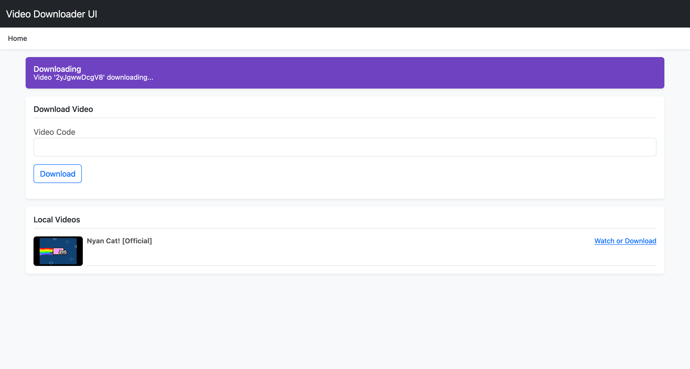

# Video Downloader UI

Project for building a user interface for video download.

This project aims to practice the use of the Sinatra framework and the use of background job libraries for asynchronous task execution.

## Installation

To install the application, simply download the project having a Ruby version above 3.0 and Bundler.

`bundler install && gem install foreman`

Once done, start the application with the command:

`foreman start`

## Functionality and Project Decisions

The project uses the `yt-dlp` tool to download videos, simulating a time-consuming process and thus uses Sucker Punch for background job execution.

The web interface is created using Bootstrap since the focus is not on working on the interface or CSS skills, and Sinatra as the web framework.

Job execution is done asynchronously, allowing the user to continue using the application while the download is in progress.

This behavior was created using Sucker Punch, a gem that implements job execution using threads, eliminating the need for extra infrastructures like Redis or databases used by other gems.

Videos are downloaded into one directory and their thumbnails into another directory to enable creating enhanced display screens in the future.

So far, no database has been considered to maintain the information, but in the future, if I still want to further study this project, I plan to use SQLite to create categories, maintain video metadata, and maybe create playlists per user.

## Author

Daniel Vinciguerra
